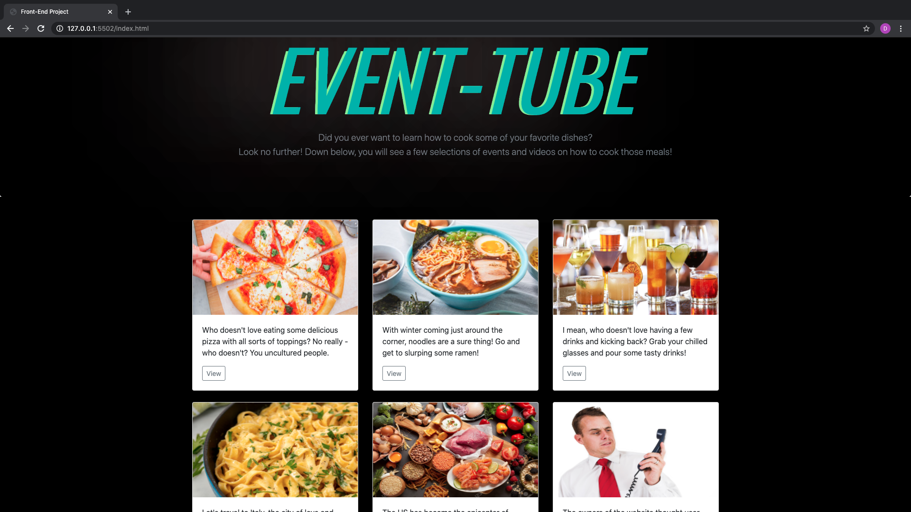
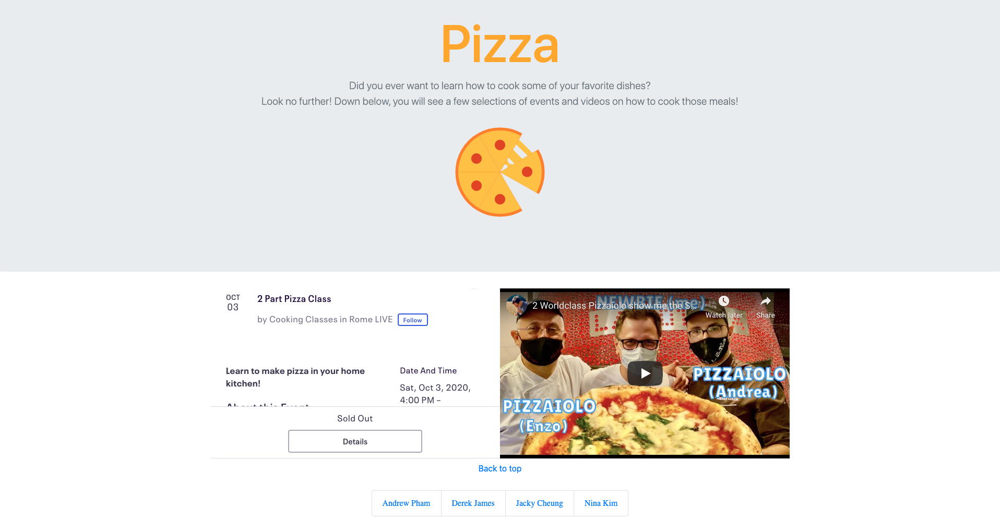
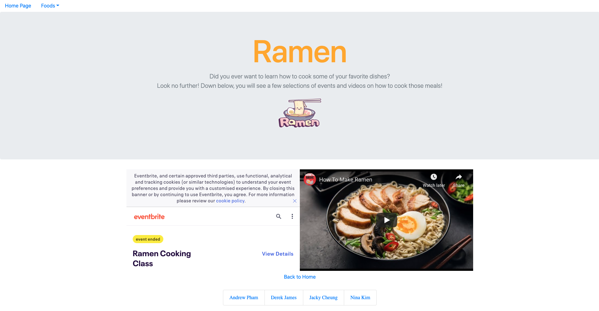
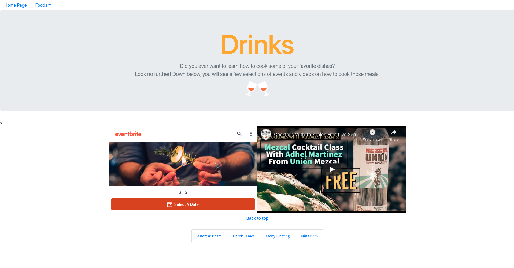
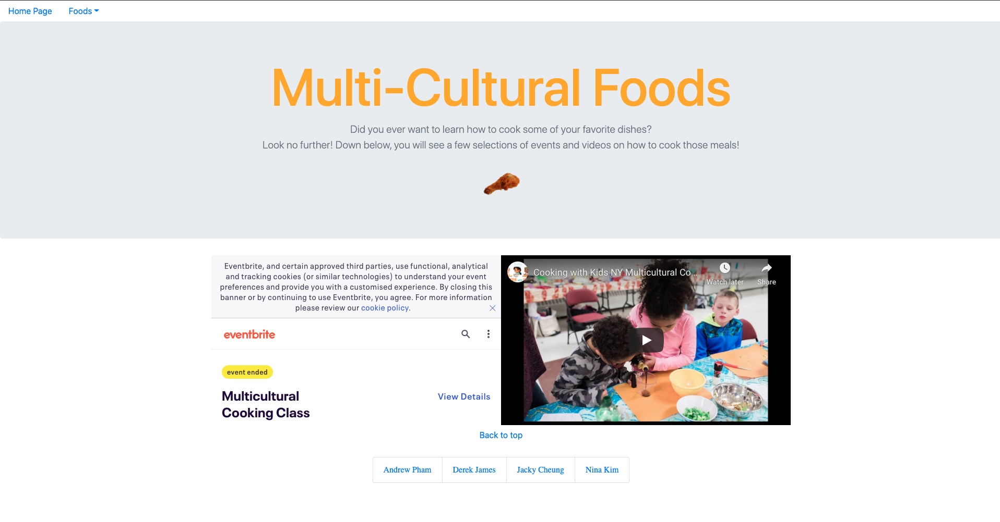
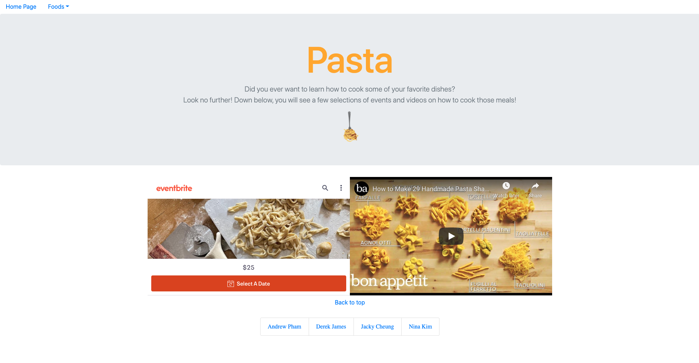

Team Members
1. Derek James
2. Andrew Pham
3. Jacky Cheung
4. Nina Kim

Languages and Technologies used
1. Node.js
2. HTML
4. CSS

Site Walkthrough:
- Home Page
On the Home page users can select what cooking class that would like to sign up for. Each of the classes has a view button which will link you to the page that contains that Event.

Event Pages

- On the pizza page we have two iframes that populate as soon as the page loads. Inside of the iframe boxes are the Eventbrite website and also a YouTube video that correlates with the active event. This will allow the user to sign up for the event without having to go the website. We took this approach on all of our even pages

1. We built this project to create a website that will pull a specific event from Eventbrite and with that information pull a video from a YouTube api. 

2. We were able to do this by fetching the data from the Eventbrite api and logging it to the YouTube search query. After the YouTube api populates with the Eventbrite data it will search YouTube for a video that is in relation to the specific event name. After it searches it will render this video onto an iframe on the page.

3. The technologies used in this project were bootstrap

4. Some of the challenges we originally faced were getting the correct information to fetch from the Eventbrite api, fixing the responsiveness, various CSS and HTML issues, and MULTIPLE YouTube api key problems

5. Problem solutions:
    1. Fetch
        - We solved the fetching problem by logging the Eventbrite api information into a json. With this we were able to properly locate the data and get the proper syntax for what we were looking for.
    2. Responsive
        - We fixed the responsiveness issue by creating a CSS property that would change certain elements on our page based on the min width of the page. We did this with a @media only screen function.
    3. Api Keys
        - We fixed the API key issues by creating multiple keys and also turning off keys whenever they were not in use.
    
    4. The website utilizes lots of bootstrap components because it helped us create a foundation for how our website would look like - and using bootstrap, that made our layout more organized and easier to customize. So much of our HTML work was going back and filtering through some bootstrap code that would be unnecessary or cause functionality issues to our JavaScript. So, bootstrap definitely helped us create the bases of what our website's final product would look like, but there were lots of changes and add-ons. So, the project definitely helped us understand bootstrap more, and how easy - yet, sometimes, complicated it became.
    
    5. The biggest successes and struggles from working on HTML and CSS came from styling and formatting. Because we spent lots of time slowly adjusting the alignments, margins, borders, padding - just inspecting the pages to ensure our website would look congruent with our other pages. The title from our home page and other image animations utilized a preexisting code that would create "glitch" effects or movement - which we thought was a cool feature to add on.